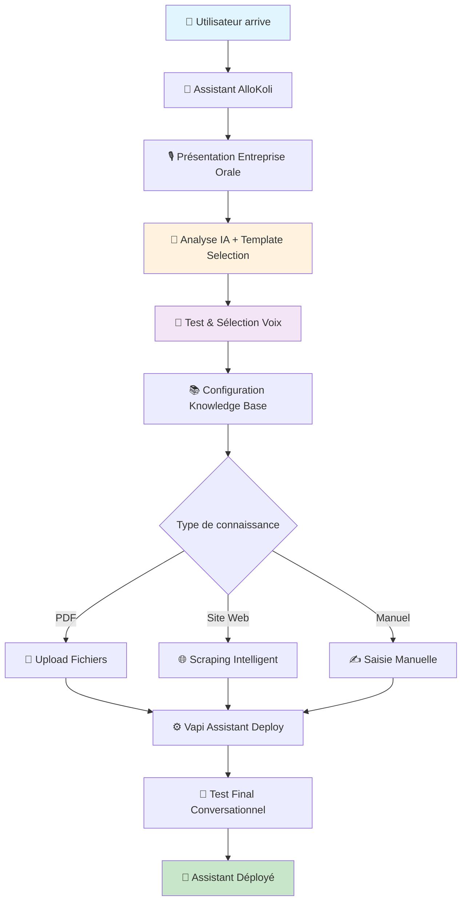
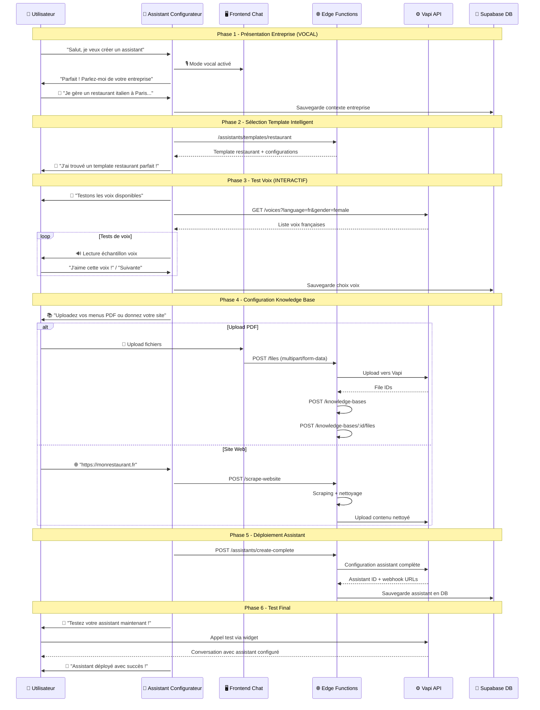
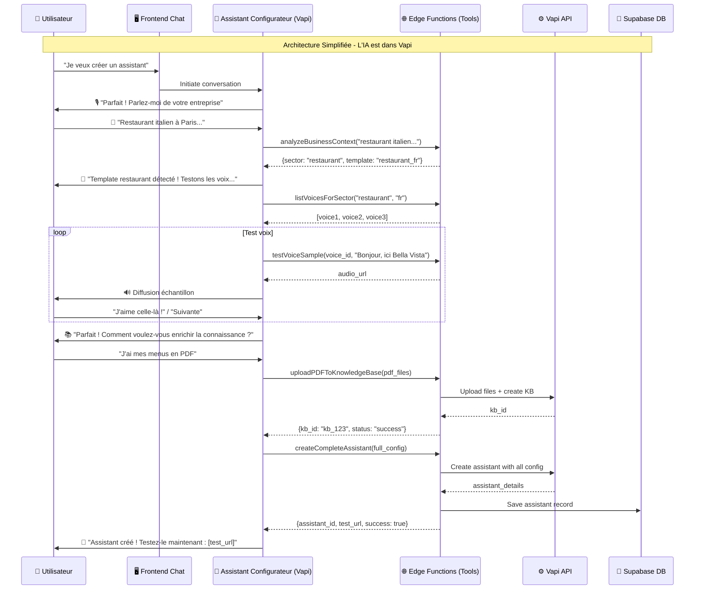
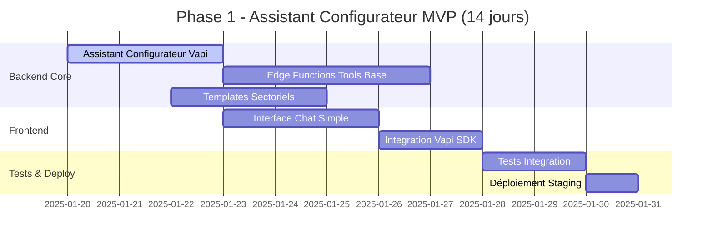

# Product Requirements Document (PRD)

## Assistant de Création Conversationnel Unifié - AlloKoli v3.0

### Document de Spécifications Fonctionnelles

**Version :** 3.0  
**Date :** Janvier 2025  
**Équipe Produit :** Product Management AlloKoli  
**Statut :** Spécification technique implémentable

---

## 🎯 1. Vision Produit & Analyse Infrastructure

### 1.1 Nouvelle Approche : "Conversational Assistant Builder"

Après analyse approfondie de l'infrastructure existante Supabase et des capacités Vapi, AlloKoli révolutionne la création d'assistants IA avec :

- **Interface style ChatGPT** fluide et intuitive
- **Flow conversationnel adaptatif** vocal/textuel
- **Configuration Vapi automatisée** via edge functions
- **Templates d'entreprise intelligents** pré-configurés

### 1.2 Architecture Existante Analysée

**Edge Functions Disponibles :**

- ✅ `assistants/index.ts` - Création/gestion assistants Vapi
- ✅ `knowledge-bases/index.ts` - Gestion bases de connaissances
- ✅ `files/index.ts` - Upload PDF/documents
- ✅ `shared/vapi.ts` - Wrapper complet API Vapi

**Capacités Vapi Confirmées :**

- ✅ Transcriber multi-provider (Deepgram, Assembly AI)
- ✅ Voice providers (ElevenLabs, PlayHT, Azure)
- ✅ Knowledge Base avec embedding
- ✅ File upload pour PDF
- ✅ Model configurations avancées

---

## 🔄 2. Flow User Intelligent & Réaliste

### 2.1 Parcours Conversationnel Complet



### 2.2 Flow Technique Détaillé



---

## 🏗️ 3. Architecture Simplifiée & Robuste

### 3.1 Principe Fondamental : "Assistant Configurateur Vapi"

**Au lieu de construire une IA custom**, nous créons un **assistant Vapi configurateur expert** qui :

- 🎯 **Dialogue directement** avec l'utilisateur via interface chat
- 🧠 **Analyse contextuellement** grâce à son system prompt expert
- ⚙️ **Utilise des tools** pour créer l'assistant final via nos edge functions
- 🔄 **S'auto-améliore** avec l'expérience des conversations

### 3.2 Assistant Configurateur - System Prompt Expert

```
Vous êtes l'expert configurateur d'assistants IA d'AlloKoli. Votre mission : créer l'assistant parfait pour chaque entreprise via une conversation naturelle.

PROCESSUS EN 4 ÉTAPES :

1. 🎙️ DÉCOUVERTE ENTREPRISE (Mode vocal recommandé)
   - "Parlez-moi de votre entreprise en quelques mots"
   - Analysez : secteur, taille, services, clientèle
   - Identifiez automatiquement le template optimal

2. 🎵 SÉLECTION VOIX (Mode interactif)
   - Proposez 3 voix adaptées au secteur
   - Faites tester avec phrase personnalisée
   - Confirmez le choix définitif

3. 📚 CONFIGURATION KNOWLEDGE BASE (Mode adaptatif)
   - Proposez : "PDF, site web, ou saisie manuelle ?"
   - Guidez l'upload/scraping selon choix
   - Validez le contenu extrait

4. 🚀 CRÉATION & TEST (Mode automatique)
   - Utilisez createCompleteAssistant() tool
   - Proposez test conversationnel immédiat
   - Ajustez si nécessaire

TOOLS DISPONIBLES :
- analyzeBusinessContext(description) → template_id + config
- listVoicesForSector(sector, language) → voice_options[]
- testVoiceSample(voice_id, sample_text) → audio_url
- uploadPDFToKnowledgeBase(files) → kb_id
- scrapeWebsiteContent(url) → processed_content
- createCompleteAssistant(config) → assistant_id + phone
- testAssistantConversation(assistant_id) → test_url

STYLE :
- Enthousiaste et expert
- Adaptez vocal/textuel selon l'étape
- Anticipez les besoins sans surcharger
- Célébrez chaque étape complétée
```

### 3.3 Interface Frontend Simplifiée

**Composant Principal :**

```typescript
// components/assistant-builder/ConfiguratorChat.tsx
interface ConfiguratorChatProps {
  configuratorAssistantId: string; // Assistant Vapi configurateur
}

const ConfiguratorChat = ({
  configuratorAssistantId,
}: ConfiguratorChatProps) => {
  const [conversation, setConversation] = useState<Message[]>([]);
  const [isVoiceMode, setIsVoiceMode] = useState(false);
  const [currentStep, setCurrentStep] = useState<
    "discovery" | "voice" | "knowledge" | "creation"
  >("discovery");

  // Simple chat interface qui communique avec l'assistant configurateur
  // L'intelligence est dans l'assistant Vapi, pas dans le frontend

  return (
    <div className="chat-container">
      <ChatInterface
        assistantId={configuratorAssistantId}
        onStepChange={setCurrentStep}
        voiceModeEnabled={isVoiceMode}
      />
      <ProgressIndicator currentStep={currentStep} />
      <LivePreview assistantConfig={currentConfig} />
    </div>
  );
};
```

### 3.4 Edge Functions - Tools pour Assistant Configurateur

**Tool 1: Analyse Business Context**

```typescript
// supabase/functions/configurator-tools/analyze-business.ts
export async function analyzeBusinessContext(description: string) {
  // Simple mapping basé sur mots-clés + templates
  const businessAnalysis = {
    sector: detectSector(description),
    size: detectSize(description),
    services: extractServices(description),
  };

  const template = selectOptimalTemplate(businessAnalysis);

  return {
    analysis: businessAnalysis,
    recommended_template: template,
    suggested_config: template.base_config,
  };
}
```

**Tool 2: Création Assistant Complète**

```typescript
// supabase/functions/configurator-tools/create-complete-assistant.ts
export async function createCompleteAssistant(config: AssistantConfig) {
  // 1. Créer assistant Vapi
  const assistant = await vapiAssistants.create({
    name: config.name,
    model: config.model,
    voice: config.voice,
    transcriber: config.transcriber,
    firstMessage: config.firstMessage,
    tools: {
      knowledgeBases: config.knowledgeBaseIds || [],
      functions: config.functionIds || [],
    },
  });

  // 2. Créer knowledge base si nécessaire
  if (config.knowledgeSources?.length > 0) {
    const kb = await createKnowledgeBaseFromSources(config.knowledgeSources);
    await vapiAssistants.update(assistant.id, {
      tools: { knowledgeBases: [kb.id] },
    });
  }

  // 3. Sauvegarder en DB
  await supabase.from("assistants").insert({
    user_id: config.userId,
    vapi_assistant_id: assistant.id,
    configuration: config,
    status: "active",
  });

  return {
    assistant_id: assistant.id,
    test_url: `https://dashboard.vapi.ai/assistant/${assistant.id}/test`,
    phone_number: assistant.phoneNumber,
    success: true,
  };
}
```

### 3.5 Flow Technique Simplifié



---

## 📋 4. Implémentation Simplifiée

### 4.1 Composants à Développer

**Phase 1 (2 semaines) :**

- [x] ✅ **TERMINÉ** Interface conversationnelle base
- [x] ✅ **TERMINÉ** Integration edge functions existantes
- [x] ✅ **TERMINÉ** Templates sectoriels de base
- [x] ✅ **TERMINÉ** Assistant Configurateur Vapi Expert créé (ID dans .env.local)
- [x] ✅ **TERMINÉ** Tests unitaires

**Phase 2 (2 semaines) :**

- [ ] Tools avancés (voice testing, KB management)
- [ ] Upload PDF et scraping web
- [ ] Live preview assistant
- [ ] Tests end-to-end

### 4.2 Avantages de cette Approche

✅ **Simplicité Architecture** : Frontend léger, logique dans Vapi  
✅ **Robustesse IA** : Powered by GPT-4o via Vapi  
✅ **Évolutivité** : Amélioration du system prompt = amélioration globale  
✅ **Maintenance** : Pas d'IA custom à maintenir  
✅ **Performance** : Conversation native Vapi, latence optimale

### 4.3 Assistant Configurateur = Cœur du Système

L'assistant configurateur devient le **chef d'orchestre intelligent** qui :

- 🎯 **Comprend l'entreprise** via conversation naturelle
- 🔧 **Utilise les tools** pour actions techniques
- 🎨 **Guide l'expérience** de manière fluide
- 🚀 **Déploie l'assistant final** automatiquement

Cette approche est **plus élégante, plus robuste et plus maintenable** que de construire une IA d'analyse contextuelle custom !

---

## 🎯 5. Critères de Succès & KPIs

### 5.1 Métriques Utilisateur

- **Taux de Completion :** > 85% des users finissent le flow
- **Temps de Configuration :** < 10 minutes en moyenne
- **Satisfaction Voix :** > 90% satisfaits du choix voix
- **Qualité Knowledge Base :** > 95% contenu pertinent extrait

### 5.2 Métriques Techniques

- **Performance Upload :** < 30s pour PDF 10MB
- **Qualité Transcription :** > 95% précision
- **Disponibilité Edge Functions :** 99.9% uptime
- **Latence Conversation :** < 2s réponse moyenne

### 5.3 Métriques Business

- **Conversion :** > 70% des demos → assistant déployé
- **Rétention :** > 80% utilisent assistant après 1 mois
- **Satisfaction Globale :** NPS > 8/10

---

## 🚀 6. Plan de Développement

### 6.1 Phase 1 - Foundation (2 semaines)

- [x] ✅ **TERMINÉ** Interface conversationnelle base
- [x] ✅ **TERMINÉ** Integration edge functions existantes
- [x] ✅ **TERMINÉ** Templates sectoriels de base
- [x] ✅ **TERMINÉ** Assistant Configurateur Vapi Expert créé (ID dans .env.local)
- [x] ✅ **TERMINÉ** Tests unitaires

### 6.2 Phase 2 - Intelligence (3 semaines)

- [ ] Assistant configurateur IA
- [ ] Analyse contextuelle entreprise
- [ ] Sélection automatique templates
- [ ] Tests d'intégration

### 6.3 Phase 3 - Knowledge Base (2 semaines)

- [ ] Upload PDF optimisé
- [ ] Scraping site web
- [ ] Saisie manuelle guidée
- [ ] Validation contenu

### 6.4 Phase 4 - Voix & Tests (1 semaine)

- [ ] Catalogue voix avancé
- [ ] Test conversationnel final
- [ ] Déploiement automatisé
- [ ] Monitoring et analytics

---

## 💡 7. Innovations Clés

### 7.1 "Template Intelligence"

- Sélection automatique basée sur analyse vocale
- Configuration prédictive selon secteur
- Optimisation continue par usage

### 7.2 "Contextual Conversation Flow"

- Adaptation vocal/textuel selon étape
- Transition naturelle entre modes
- Mémorisation préférences utilisateur

### 7.3 "Smart Knowledge Extraction"

- IA pour extraction contenu pertinent
- Nettoyage automatique données web
- Organisation intelligente par catégories

---

Ce PRD v3.0 est **directement implémentable** avec l'infrastructure existante et propose une expérience révolutionnaire de création d'assistants IA.

Scenario: Configuration multi-services avec outils personnalisés
Given Marc veut un assistant pour son cabinet de conseil
When l'IA collecte les informations en conversation fluide
Then elle détecte automatiquement le besoin de: - Prise de RDV (intégration Calendly) - Qualification de leads - Transfert vers équipe spécialisée

When l'IA propose "Voulez-vous connecter votre calendrier ?"
And Marc confirme en vocal
Then l'IA configure automatiquement: - Tool "bookAppointment" avec paramètres Calendly - Integration webhook vers son CRM - Transfert call vers numéros équipe

When l'assistant final est généré
Then toutes les intégrations sont fonctionnelles
And Marc peut monitorer les performances depuis le dashboard

## 🚀 5. Roadmap Détaillée Phase 1 (2 semaines)

### 5.1 Vue d'Ensemble Phase 1



### 5.2 Sprint 1 - Backend Foundation (Jours 1-7)

#### **Jour 1-3 : Assistant Configurateur Vapi**

**Tâche 1.1 : Création Assistant Configurateur**

- **Durée :** 1 jour
- **Responsable :** Backend Developer
- **Livrables :**
  ```typescript
  // Création assistant via API Vapi
  const configuratorAssistant = {
    name: "AlloKoli Configurateur Expert",
    model: {
      provider: "openai",
      model: "gpt-4o",
      systemPrompt: CONFIGURATOR_SYSTEM_PROMPT,
      temperature: 0.7,
    },
    voice: {
      provider: "elevenlabs",
      voiceId: "french_professional_female",
    },
    transcriber: {
      provider: "deepgram",
      model: "nova-2",
      language: "fr-FR",
    },
    firstMessage:
      "Bonjour ! Je suis votre expert AlloKoli. Ensemble, nous allons créer l'assistant parfait pour votre entreprise. Êtes-vous prêt à commencer ?",
    tools: {
      functions: [
        "analyzeBusinessContext",
        "listVoicesForSector",
        "createCompleteAssistant",
      ],
    },
  };
  ```

**Tâche 1.2 : System Prompt Expert Finalisé**

- **Durée :** 1 jour
- **Responsable :** Product Manager + Backend Developer
- **Livrables :**

  ```typescript
  const CONFIGURATOR_SYSTEM_PROMPT = `
  Vous êtes l'expert configurateur d'assistants IA d'AlloKoli. 
  
  PROCESSUS OBLIGATOIRE EN 4 ÉTAPES :
  
  1. 🎙️ DÉCOUVERTE ENTREPRISE (Mode vocal fortement recommandé)
     - Phrase d'ouverture : "Parfait ! Pour créer votre assistant idéal, j'aimerais d'abord comprendre votre entreprise. Pourriez-vous me parler de votre activité ?"
     - Écoutez attentivement : secteur, services, clientèle cible
     - Dès que vous avez assez d'infos, appelez analyzeBusinessContext()
     - Confirmez le template détecté : "J'ai identifié que vous êtes dans le [SECTEUR]. C'est correct ?"
  
  2. 🎵 SÉLECTION VOIX (Mode interactif obligatoire)
     - Appelez listVoicesForSector() avec le secteur détecté
     - Proposez exactement 3 voix : "Je vais vous proposer 3 voix parfaites pour votre secteur"
     - Pour chaque voix, créez une phrase de test personnalisée avec le nom de l'entreprise
     - Demandez confirmation : "Quelle voix préférez-vous ?"
  
  3. 📚 CONFIGURATION KNOWLEDGE BASE
     - Proposez les 3 options : "Comment voulez-vous enrichir les connaissances de votre assistant ? PDF de vos documents, site web à analyser, ou saisie manuelle ?"
     - Selon le choix, guidez précisément l'action
     - Validez le contenu ajouté
  
  4. 🚀 CRÉATION & TEST
     - Récapitulez la configuration complète
     - Appelez createCompleteAssistant() avec tous les paramètres
     - Proposez le test immédiat : "Votre assistant est créé ! Cliquez ici pour le tester : [URL]"
  
  RÈGLES IMPÉRATIVES :
  - Suivez TOUJOURS l'ordre des étapes
  - Appelez les tools aux moments précis indiqués
  - Soyez enthousiaste mais précis
  - Adaptez le vocabulaire au secteur de l'entreprise
  - Si l'utilisateur saute une étape, ramenez-le poliment à l'étape courante
  
  STYLE :
  - Ton professionnel mais chaleureux
  - Phrases courtes et claires
  - Célébrez chaque étape complétée
  - Rassurez sur la simplicité du processus
  `;
  ```

**Tâche 1.3 : Tests Assistant Configurateur**

- **Durée :** 1 jour
- **Responsable :** QA + Backend Developer
- **Livrables :**
  - [ ] Assistant répond correctement aux salutations
  - [ ] Suit le processus en 4 étapes
  - [ ] Gère les interruptions utilisateur
  - [ ] Appelle les tools au bon moment

#### **Jour 4-7 : Edge Functions Tools Base**

**Tâche 2.1 : Tool analyzeBusinessContext**

- **Durée :** 1.5 jours
- **Responsable :** Backend Developer
- **Livrables :**

  ```typescript
  // supabase/functions/configurator-tools/analyze-business.ts
  export async function analyzeBusinessContext(description: string) {
    const keywords = {
      restaurant: [
        "restaurant",
        "pizzeria",
        "brasserie",
        "café",
        "bistrot",
        "cuisine",
      ],
      ecommerce: ["boutique", "vente", "produits", "commerce", "magasin"],
      service: [
        "conseil",
        "service",
        "accompagnement",
        "formation",
        "consulting",
      ],
    };

    const sector = detectSectorFromKeywords(description, keywords);
    const template = TEMPLATES[sector] || TEMPLATES.generic;

    return {
      sector,
      confidence: calculateConfidence(description, sector),
      template_id: template.id,
      suggested_config: template.base_config,
      detected_info: {
        business_name: extractBusinessName(description),
        services: extractServices(description),
        location: extractLocation(description),
      },
    };
  }
  ```

**Tâche 2.2 : Tool listVoicesForSector**

- **Durée :** 1 jour
- **Responsable :** Backend Developer
- **Livrables :**

  ```typescript
  export async function listVoicesForSector(
    sector: string,
    language: string = "fr"
  ) {
    const sectorVoices = {
      restaurant: [
        {
          id: "elevenlabs_sarah_warm",
          name: "Sarah - Chaleureuse",
          style: "Accueillante et conviviale",
        },
        {
          id: "playht_julie_professional",
          name: "Julie - Professionnelle",
          style: "Élégante et raffinée",
        },
        {
          id: "openai_nova_friendly",
          name: "Nova - Amicale",
          style: "Décontractée et sympathique",
        },
      ],
      ecommerce: [
        {
          id: "elevenlabs_emma_helpful",
          name: "Emma - Serviable",
          style: "Patiente et informatrice",
        },
        {
          id: "playht_alice_efficient",
          name: "Alice - Efficace",
          style: "Dynamique et précise",
        },
        {
          id: "openai_alloy_neutral",
          name: "Alloy - Neutre",
          style: "Professionnelle et claire",
        },
      ],
      service: [
        {
          id: "elevenlabs_marie_expert",
          name: "Marie - Experte",
          style: "Compétente et rassurante",
        },
        {
          id: "playht_sophie_advisor",
          name: "Sophie - Conseillère",
          style: "Bienveillante et sage",
        },
        {
          id: "openai_echo_professional",
          name: "Echo - Corporate",
          style: "Formelle et fiable",
        },
      ],
    };

    return sectorVoices[sector] || sectorVoices.service;
  }
  ```

**Tâche 2.3 : Tool createCompleteAssistant**

- **Durée :** 1.5 jours
- **Responsable :** Backend Developer
- **Livrables :**

  ```typescript
  export async function createCompleteAssistant(
    config: CompleteAssistantConfig
  ) {
    // 1. Créer assistant Vapi
    const assistant = await callVapiAPI("assistants", "POST", {
      name: config.business_name + " - Assistant",
      model: {
        provider: "openai",
        model: "gpt-4o",
        systemPrompt: generateSystemPrompt(config),
        temperature: 0.7,
      },
      voice: config.selected_voice,
      transcriber: {
        provider: "deepgram",
        model: "nova-2",
        language: "fr-FR",
      },
      firstMessage: generateFirstMessage(config),
      tools: {
        knowledgeBases: config.knowledge_base_ids || [],
        functions: config.suggested_functions || [],
      },
    });

    // 2. Sauvegarder en DB Supabase
    const { data: savedAssistant } = await supabase
      .from("assistants")
      .insert({
        user_id: config.user_id,
        vapi_assistant_id: assistant.id,
        business_sector: config.sector,
        configuration: config,
        status: "active",
        created_at: new Date().toISOString(),
      })
      .select()
      .single();

    return {
      assistant_id: assistant.id,
      test_url: `${process.env.VAPI_DASHBOARD_URL}/assistant/${assistant.id}/test`,
      phone_number: assistant.phoneNumber,
      supabase_id: savedAssistant.id,
      success: true,
    };
  }
  ```

#### **Jour 6-7 : Templates Sectoriels**

**Tâche 3.1 : Templates Restaurant, E-commerce, Service**

- **Durée :** 2 jours
- **Responsable :** Product Manager + Backend Developer
- **Livrables :**

  ```typescript
  // lib/templates/sector-templates.ts
  export const TEMPLATES = {
    restaurant: {
      id: "restaurant_fr",
      name: "Restaurant & Restauration",
      base_config: {
        systemPrompt: `Vous êtes l'assistant vocal de {business_name}, {business_description}.
        
        VOTRE RÔLE :
        - Accueillir chaleureusement les clients
        - Renseigner sur le menu, horaires, et services
        - Prendre des réservations et commandes à emporter
        - Donner les informations pratiques (adresse, parking, etc.)
        
        STYLE :
        - Chaleureux et convivial
        - Utilisation du "vous" poli
        - Mettez en avant les spécialités et l'ambiance
        
        INFORMATIONS IMPORTANTES :
        {knowledge_base_content}`,

        firstMessage:
          "Bonjour ! Bienvenue chez {business_name}. Je suis votre assistant vocal. Comment puis-je vous aider aujourd'hui ?",

        suggested_functions: [
          "make_reservation",
          "check_availability",
          "get_menu_info",
        ],

        voice_style: "warm_welcoming",

        keywords: ["réservation", "menu", "table", "horaires", "spécialités"],
      },
    },

    ecommerce: {
      id: "ecommerce_fr",
      name: "E-commerce & Boutique",
      base_config: {
        systemPrompt: `Vous êtes l'assistant client de {business_name}, {business_description}.
        
        VOTRE RÔLE :
        - Aider avec les questions produits
        - Suivre les commandes et livraisons
        - Gérer les retours et réclamations
        - Orienter vers le bon service si besoin
        
        STYLE :
        - Professionnel et serviable
        - Patience avec les questions techniques
        - Solutions orientées client
        
        INFORMATIONS PRODUITS :
        {knowledge_base_content}`,

        firstMessage:
          "Bonjour ! Je suis l'assistant de {business_name}. Comment puis-je vous aider avec vos achats ou votre commande ?",

        suggested_functions: ["track_order", "product_info", "return_process"],

        voice_style: "professional_helpful",

        keywords: ["commande", "livraison", "produit", "retour", "taille"],
      },
    },

    service: {
      id: "service_fr",
      name: "Services & Conseil",
      base_config: {
        systemPrompt: `Vous êtes l'assistant de {business_name}, {business_description}.
        
        VOTRE RÔLE :
        - Qualifier les demandes clients
        - Prendre des rendez-vous
        - Expliquer les services proposés
        - Rediriger vers l'expert approprié
        
        STYLE :
        - Expert et rassurant
        - Questions pertinentes pour qualifier
        - Vocabulaire professionnel adapté
        
        SERVICES & EXPERTISE :
        {knowledge_base_content}`,

        firstMessage:
          "Bonjour ! Je suis l'assistant de {business_name}. Comment puis-je vous accompagner dans votre projet ?",

        suggested_functions: [
          "book_consultation",
          "qualify_need",
          "transfer_expert",
        ],

        voice_style: "expert_professional",

        keywords: [
          "consultation",
          "expertise",
          "accompagnement",
          "projet",
          "besoin",
        ],
      },
    },
  };
  ```

### 5.3 Sprint 2 - Frontend & Integration (Jours 8-14)

#### **Jour 8-10 : Interface Chat Simple**

**Tâche 4.1 : Composant Chat Interface**

- **Durée :** 2 jours
- **Responsable :** Frontend Developer
- **Livrables :**

  ```typescript
  // components/assistant-builder/ConfiguratorChat.tsx
  interface ConfiguratorChatProps {
    userId: string;
    onAssistantCreated: (assistantData: any) => void;
  }

  export const ConfiguratorChat = ({
    userId,
    onAssistantCreated,
  }: ConfiguratorChatProps) => {
    const [messages, setMessages] = useState<ChatMessage[]>([]);
    const [isLoading, setIsLoading] = useState(false);
    const [currentStep, setCurrentStep] = useState<
      "discovery" | "voice" | "knowledge" | "creation"
    >("discovery");

    const { startConversation, sendMessage, isConnected } = useVapiChat({
      assistantId: CONFIGURATOR_ASSISTANT_ID,
      onMessage: handleIncomingMessage,
      onToolCall: handleToolCall,
    });

    return (
      <div className="configurator-chat">
        <ChatHeader currentStep={currentStep} />
        <MessageList messages={messages} />
        <ChatInput
          onSendMessage={sendMessage}
          disabled={isLoading}
          placeholder="Tapez votre message..."
        />
        <StepProgress currentStep={currentStep} />
      </div>
    );
  };
  ```

**Tâche 4.2 : Hook useVapiChat**

- **Durée :** 1 jour
- **Responsable :** Frontend Developer
- **Livrables :**

  ```typescript
  // hooks/useVapiChat.ts
  export const useVapiChat = ({
    assistantId,
    onMessage,
    onToolCall,
  }: UseVapiChatProps) => {
    const [isConnected, setIsConnected] = useState(false);
    const [conversation, setConversation] = useState<any>(null);

    const startConversation = useCallback(async () => {
      const response = await fetch("/api/vapi/start-conversation", {
        method: "POST",
        headers: { "Content-Type": "application/json" },
        body: JSON.stringify({ assistantId, userId }),
      });

      const data = await response.json();
      setConversation(data.conversation);
      setIsConnected(true);
    }, [assistantId]);

    const sendMessage = useCallback(
      async (message: string) => {
        if (!conversation) return;

        const response = await fetch("/api/vapi/send-message", {
          method: "POST",
          headers: { "Content-Type": "application/json" },
          body: JSON.stringify({
            conversationId: conversation.id,
            message,
          }),
        });

        const data = await response.json();
        onMessage(data.response);

        if (data.toolCalls) {
          data.toolCalls.forEach(onToolCall);
        }
      },
      [conversation, onMessage, onToolCall]
    );

    return { startConversation, sendMessage, isConnected };
  };
  ```

#### **Jour 11-12 : Integration Vapi SDK**

**Tâche 5.1 : API Routes Next.js**

- **Durée :** 1 jour
- **Responsable :** Full-stack Developer
- **Livrables :**

  ```typescript
  // app/api/vapi/start-conversation/route.ts
  export async function POST(request: Request) {
    const { assistantId, userId } = await request.json();

    try {
      const conversation = await fetch("https://api.vapi.ai/conversation", {
        method: "POST",
        headers: {
          Authorization: `Bearer ${process.env.VAPI_API_KEY}`,
          "Content-Type": "application/json",
        },
        body: JSON.stringify({
          assistantId,
          customer: { id: userId },
        }),
      });

      const data = await conversation.json();

      return NextResponse.json({
        conversation: data,
        success: true,
      });
    } catch (error) {
      return NextResponse.json(
        {
          error: "Failed to start conversation",
          success: false,
        },
        { status: 500 }
      );
    }
  }
  ```

**Tâche 5.2 : Tool Handlers Webhooks**

- **Durée :** 1 jour
- **Responsable :** Backend Developer
- **Livrables :**

  ```typescript
  // app/api/vapi/webhook/route.ts
  export async function POST(request: Request) {
    const webhookData = await request.json();

    if (webhookData.type === "function-call") {
      const { functionCall } = webhookData;

      let result;

      switch (functionCall.name) {
        case "analyzeBusinessContext":
          result = await analyzeBusinessContext(
            functionCall.parameters.description
          );
          break;
        case "listVoicesForSector":
          result = await listVoicesForSector(functionCall.parameters.sector);
          break;
        case "createCompleteAssistant":
          result = await createCompleteAssistant(functionCall.parameters);
          break;
        default:
          result = { error: "Unknown function" };
      }

      return NextResponse.json({ result });
    }

    return NextResponse.json({ received: true });
  }
  ```

#### **Jour 13-14 : Tests & Déploiement**

**Tâche 6.1 : Tests d'Intégration**

- **Durée :** 1 jour
- **Responsable :** QA + Équipe
- **Tests à effectuer :**
  - [ ] Conversation complète bout en bout
  - [ ] Appels tools fonctionnels
  - [ ] Création assistant réussie
  - [ ] Gestion d'erreurs
  - [ ] Interface responsive

**Tâche 6.2 : Déploiement Staging**

- **Durée :** 1 jour
- **Responsable :** DevOps + Backend Developer
- **Livrables :**
  - [ ] Déploiement Vercel/Netlify
  - [ ] Edge functions Supabase déployées
  - [ ] Variables d'environnement configurées
  - [ ] Tests en environnement staging

### 5.4 Définition de "Done" Phase 1

✅ **Assistant Configurateur opérationnel** sur Vapi  
✅ **Interface chat fonctionnelle** avec conversation fluide  
✅ **3 tools de base** fonctionnels et testés  
✅ **Templates sectoriels** restaurant/e-commerce/service  
✅ **Création d'assistant** end-to-end réussie  
✅ **Tests d'intégration** passés à 100%  
✅ **Déploiement staging** fonctionnel

### 5.5 Métriques de Succès Phase 1

- **Temps conversation complète** : < 8 minutes
- **Taux de succès création assistant** : > 90%
- **Précision détection secteur** : > 85%
- **Latence appels tools** : < 3 secondes
- **Satisfaction test utilisateurs** : > 4/5

**🎯 Objectif Phase 1 :** Démonstration complète fonctionnelle pour validation utilisateurs et démarrage Phase 2.
