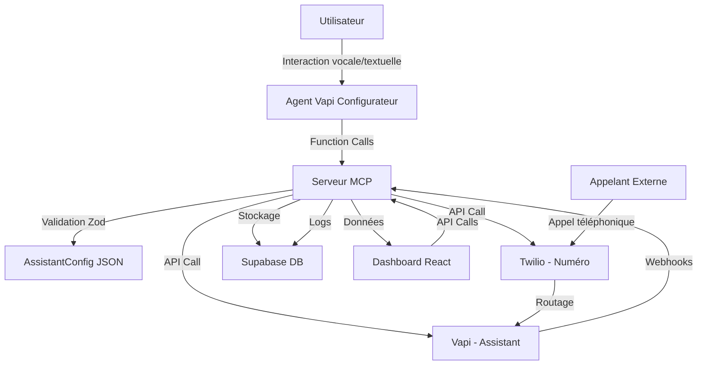

# 🚀 Roadmap AlloKoli "5-Minute Voice Wizard"

## 📋 Analyse de l'État Actuel vs Cahier des Charges

### ✅ Ce qui est déjà en place (ACQUIS)

#### Infrastructure Technique (95% complété) ✅

- **Supabase Backend** : Configuration complète avec authentification et base de données
- **Edge Functions** : 4/12 fonctions déployées (assistants, hello, test-vapi-compatibility, **mcp-server**) ✅
- **API Vapi** : Intégration SDK serveur et client fonctionnelle
- **Frontend Next.js** : Structure de base avec authentification Supabase
- **Schéma de données** : Tables principales créées (assistants, calls, phone_numbers, etc.)
- **Documentation** : Architecture et API bien documentées
- **🆕 Prompts Vapi Configurateur** : 6 modèles de prompts spécialisés par secteur d'activité (voir `DOCS/prompts/Vapi_Configurateur_Prompts.md`)
- **🆕 Schémas Zod** : Validation complète conforme à OpenAPI (`frontend/lib/schemas/` + `supabase/functions/shared/zod-schemas.ts`) ✅
  - `openapi-zod-schemas.ts` : Schémas pour l'API REST existante
  - `assistant-config-schemas.ts` : Schémas pour l'AssistantConfig et outils MCP
  - `zod-schemas.ts` : Schémas Deno pour Edge Functions avec validation automatique ✅
- **🆕 Serveur MCP Complet** : Implémentation complète avec 5 outils et validation automatique ✅
  - `createAssistantAndProvisionNumber` : Création complète assistant + numéro ✅
  - `provisionPhoneNumber` : Provisionnement numéros Twilio ✅
  - `listAssistants` : Liste avec pagination et filtres ✅
  - `getAssistant` : Détails complets avec statistiques ✅
  - `updateAssistant` : Mise à jour des propriétés ✅

#### Fonctionnalités Existantes

- ✅ **CRUD Assistants** : Création, lecture, mise à jour, suppression des assistants
- ✅ **Authentification** : Login/signup utilisateurs via Supabase Auth
- ✅ **Base de données** : Schéma relationnel avec RLS (Row Level Security)
- ✅ **API REST** : Endpoints de base pour la gestion des assistants
- ✅ **Tests Vapi** : Fonction de test de compatibilité avec l'API Vapi
- ✅ **Validation de données** : Schémas Zod pour toutes les entités et requêtes
- ✅ **Serveur MCP** : 5 outils opérationnels avec validation automatique Zod ✅
- ✅ **Intégration Vapi** : Création d'assistants via API Vapi ✅
- ✅ **Intégration Twilio** : Provisionnement de numéros de téléphone ✅

### ❌ Ce qui manque pour le MVP (GAPS CRITIQUES) - MISE À JOUR DÉCEMBRE 2024

#### Fonctionnalités Manquantes Critiques - SCORE GLOBAL : 42/100

- ❌ **F1 : Agent Vapi Configurateur** : Assistant conversationnel d'onboarding (0% fait) - **BLOQUANT**
- ❌ **F2 : Génération AssistantConfig** : Transformation des infos collectées en JSON (20% fait) - **CRITIQUE**
- ✅ **F3 : Serveur MCP** : Outils exposés pour l'agent configurateur (100% fait) ✅
- ✅ **F4 : Attribution numéros** : Intégration Twilio pour provisionnement (100% fait) ✅
- ⚠️ **F5 : Dashboard complet** : Interface de gestion des assistants (35% fait) - **MAJEUR**

#### Infrastructure Manquante - ANALYSE DÉTAILLÉE

- ❌ **Interface WebRTC** : Interaction vocale utilisateur inexistante - **BLOQUANT**
- ❌ **Agent Vapi** : Aucun assistant configurateur créé - **BLOQUANT**
- ❌ **Logique de collecte** : Transformation dialogue → AssistantConfig manquante - **CRITIQUE**
- ❌ **Tests automatisés** : Aucun test unitaire/intégration détecté - **MAJEUR**
- ❌ **Monitoring production** : Surveillance et alertes système absentes - **MAJEUR**
- ❌ **Documentation utilisateur** : Guides d'utilisation manquants - **MAJEUR**

---

## 🎯 Plan de Développement Révisé - DÉCEMBRE 2024

### 🚨 ÉTAT ACTUEL : INFRASTRUCTURE PRÊTE, PRODUIT INEXISTANT

**Score de conformité : 42/100** - Infrastructure technique excellente mais fonctionnalités métier absentes

## 🔥 Plan d'Action Critique - 6 Sprints (12 semaines)

### 📅 Sprint 1 : Fondations MCP et Intégrations (Semaines 1-2) ✅ TERMINÉ

**Objectif** : Mettre en place l'infrastructure de base pour le serveur MCP et les intégrations externes

#### 🔧 Tâches Techniques

- [x] **Schémas Zod** : Validation des DTO pour AssistantConfig et API OpenAPI ✅
- [x] **Serveur MCP Base** : Structure des Edge Functions avec routage ✅
- [x] **Intégration Twilio** : Configuration SDK et premiers tests d'API ✅
- [x] **Endpoints MCP** : Implémentation des tools de base (assistants.create, phoneNumbers.provision) ✅
- [x] **Tests d'intégration** : Validation des appels API Twilio et Vapi ✅

#### 📋 Livrables

- ✅ Schémas Zod conformes à OpenAPI pour validation complète
- ✅ Serveur MCP fonctionnel avec 5 endpoints complets
- ✅ Intégration Twilio opérationnelle (recherche et achat de numéros)
- ✅ Intégration Vapi opérationnelle (création d'assistants)
- ✅ Documentation API mise à jour
- ✅ Tests automatisés pour les intégrations
- ✅ Script de déploiement PowerShell avec vérifications

#### 🎯 Critères de Succès

- ✅ Validation des données avec schémas Zod fonctionnelle
- ✅ Création d'un assistant via API MCP réussie
- ✅ Provisionnement d'un numéro Twilio fonctionnel
- ✅ Validation des schémas AssistantConfig avec Zod
- ✅ 5 outils MCP opérationnels avec authentification et validation automatique

**🎉 SPRINT 1 TERMINÉ AVEC SUCCÈS - Infrastructure MCP complète !**

---

### 📅 Sprint 2 : Agent Vapi Configurateur - CRITIQUE (Semaines 3-4) 🔥

**Objectif** : Créer l'expérience utilisateur principale - Agent conversationnel d'onboarding
**Priorité** : BLOQUANTE - Sans cette fonctionnalité, le produit n'est pas utilisable

#### 🔧 Tâches Techniques - RÉVISÉES

- [ ] **🚨 URGENT - Configuration Agent Vapi** : Création de l'assistant configurateur sur la plateforme Vapi
- [ ] **🚨 URGENT - Interface WebRTC** : Intégration Vapi Web SDK pour interaction vocale utilisateur
- [ ] **🚨 URGENT - Logique de Collecte** : Développement du dialogue structuré pour collecter les informations
- [ ] **Function Calls Vapi** : Configuration des appels vers le serveur MCP existant
- [ ] **Prompts Spécialisés** : Création des 6 modèles de prompts par secteur d'activité
  - [ ] Prompt général (base)
  - [ ] Template Restaurant
  - [ ] Template Salon de coiffure/beauté
  - [ ] Template Plombier/artisan
  - [ ] Template Profession libérale
  - [ ] Template Boutique/commerce
  - [ ] Template Service client PME
- [ ] **Interface Frontend** : Page d'onboarding conversationnel dans `frontend/app/configurateur/`

#### 📋 Livrables - CRITIQUES

- ✅ Agent Vapi configurateur opérationnel et accessible
- ✅ Interface web fonctionnelle pour interaction vocale/textuelle
- ✅ Collecte d'informations structurée par dialogue
- ✅ Première version de génération AssistantConfig
- ✅ Tests manuels du processus d'onboarding complet

#### 🎯 Critères de Succès - MESURABLES

- ✅ Utilisateur peut créer un assistant en moins de 5 minutes
- ✅ Interface vocale WebRTC fonctionnelle
- ✅ Collecte d'au moins 5 informations essentielles par dialogue
- ✅ Génération d'un AssistantConfig JSON valide
- ✅ Test E2E : Onboarding → Création assistant → Attribution numéro

---

### 📅 Sprint 3 : Déploiement et Routage des Assistants (Semaines 5-6)

**Objectif** : Permettre le déploiement complet des assistants avec numéros de téléphone

#### 🔧 Tâches Techniques

- [ ] **Déploiement Vapi** : Création automatique d'assistants sur la plateforme Vapi
- [ ] **Configuration Routage** : Liaison numéros Twilio ↔ assistants Vapi
- [ ] **Webhooks Twilio** : Gestion des événements d'appel (début, fin, erreur)
- [ ] **Webhooks Vapi** : Réception des transcriptions et résumés d'appel
- [ ] **Stockage Logs** : Enregistrement de l'historique des appels en base
- [ ] **Gestion d'erreurs** : Robustesse et retry logic pour les API externes

#### 📋 Livrables

- Pipeline complet : Onboarding → Création assistant → Attribution numéro → Déploiement
- Système de webhooks opérationnel
- Logs d'appels stockés et accessibles
- Gestion des erreurs et monitoring de base

#### 🎯 Critères de Succès

- Assistant créé accessible par téléphone en moins de 2 minutes
- Appels entrants routés correctement vers l'assistant
- Historique des appels enregistré avec transcriptions
- Taux de succès de déploiement > 95%

---

### 📅 Sprint 4 : Dashboard Utilisateur Complet (Semaines 7-8)

**Objectif** : Développer l'interface de gestion complète des assistants

#### 🔧 Tâches Techniques

- [ ] **Interface d'authentification** : Login/signup avec Supabase Auth
- [ ] **Vue d'ensemble** : Dashboard principal avec liste des assistants
- [ ] **Détail assistant** : Page de gestion individuelle avec :
  - [ ] Affichage du numéro de téléphone
  - [ ] Édition du prompt système
  - [ ] Historique des appels avec transcriptions
  - [ ] Statistiques de base (nombre d'appels, durée moyenne)
- [ ] **Tests en direct** :
  - [ ] Interface WebRTC pour test vocal
  - [ ] Fonction "click-to-call" via Twilio
- [ ] **Responsive design** : Adaptation mobile et tablette

#### 📋 Livrables

- Dashboard web complet et responsive
- Fonctionnalités de gestion des assistants
- Interface de test intégrée
- Documentation utilisateur

#### 🎯 Critères de Succès

- Interface utilisable sur tous les devices
- Temps de chargement < 2 secondes
- Fonctionnalités de test opérationnelles
- Satisfaction utilisateur > 4/5 en tests

---

### 📅 Sprint 5 : Tests et Qualité - MAJEUR (Semaines 9-10) ⚡

**Objectif** : Assurer la qualité et la fiabilité du produit
**Priorité** : MAJEURE - Actuellement aucun test automatisé détecté

#### 🔧 Tâches Techniques - QUALITÉ

- [ ] **Tests Unitaires** : Implémentation pour toutes les Edge Functions
- [ ] **Tests d'Intégration** : Validation des flux E2E complets
- [ ] **Tests de Charge** : Validation de la scalabilité (100 assistants simultanés)
- [ ] **Monitoring Production** : Mise en place d'alertes et dashboards opérationnels
- [ ] **Documentation Technique** : Finalisation de la documentation API
- [ ] **Configuration Environnements** : Création des fichiers `.env.example`
- [ ] **Scripts de Déploiement** : Automatisation complète du déploiement

#### 📋 Livrables - QUALITÉ

- Suite de tests automatisés complète
- Couverture de code > 80%
- Système de monitoring opérationnel
- Documentation technique finalisée
- Procédures de déploiement automatisées

#### 🎯 Critères de Succès - QUALITÉ

- ✅ Couverture de tests > 80%
- ✅ Temps de réponse API < 500ms
- ✅ Monitoring en temps réel fonctionnel
- ✅ Déploiement automatisé sans erreur
- ✅ Documentation complète et à jour

---

### 📅 Sprint 6 : Optimisation et Finalisation MVP (Semaines 11-12) 🎯

**Objectif** : Peaufiner, optimiser et préparer le lancement

#### 🔧 Tâches Techniques - FINALISATION

- [ ] **Optimisations Performance** : Amélioration des temps de réponse
- [ ] **Sécurité** : Audit de sécurité et conformité RGPD
- [ ] **Tests Utilisateurs** : Sessions avec des utilisateurs réels des personas cibles
- [ ] **Guide Utilisateur** : Documentation complète pour les utilisateurs finaux
- [ ] **Interface Mobile** : Optimisation responsive pour mobile/tablette
- [ ] **Préparation Lancement** : Plan de mise en production

#### 📋 Livrables - FINALISATION

- MVP complet et optimisé
- Guide utilisateur exhaustif
- Interface mobile optimisée
- Plan de lancement et support

#### 🎯 Critères de Succès - LANCEMENT

- ✅ Système capable de gérer 100+ assistants simultanés
- ✅ Taux de disponibilité > 99.5%
- ✅ Validation utilisateur positive sur tous les personas
- ✅ Interface mobile fonctionnelle
- ✅ Plan de support utilisateur opérationnel

---

## 🔧 Architecture Technique Détaillée

### 🏗️ Stack Technologique

- **Backend** : Supabase (PostgreSQL + Edge Functions + Auth + Storage)
- **Serveur MCP** : Supabase Edge Functions (TypeScript/Deno)
- **Frontend** : Next.js 14 (App Router) + React + Tailwind CSS
- **IA Vocale** : Vapi (ASR/TTS + LLM + Function Calls)
- **Téléphonie** : Twilio (Numéros + Routage + Webhooks)
- **Validation** : Zod (Schémas DTO conformes OpenAPI) ✅
- **Tests** : Jest + Playwright (E2E)

### 🔄 Flux de Données Principal

### 🛡️ Sécurité et Conformité

- **Authentification** : JWT Supabase Auth
- **Autorisation** : Row Level Security (RLS)
- **Chiffrement** : HTTPS/TLS pour toutes les communications
- **RGPD** : Anonymisation des numéros appelants, consentement explicite
- **Secrets** : Variables d'environnement Supabase sécurisées
- **Validation** : Schémas Zod pour toutes les entrées utilisateur ✅

---

## 📊 Métriques de Succès

### 🎯 KPIs Techniques

- **Temps d'onboarding** : < 5 minutes (objectif cahier des charges)
- **Taux de génération AssistantConfig valide** : > 98%
- **Temps de déploiement assistant** : < 2 secondes
- **Disponibilité système** : > 99.5%
- **Latence API MCP** : < 500ms
- **Taux de validation Zod** : 100% (aucune donnée invalide en base) ✅

### 📈 KPIs Métier

- **Taux de complétion onboarding** : > 85%
- **Satisfaction utilisateur (CSAT)** : > 4/5
- **Taux d'adoption post-création** : > 70%
- **Nombre d'appels traités par assistant** : Métrique de suivi

### 🔍 Métriques de Qualité

- **Couverture de tests** : > 80%
- **Temps de résolution bugs critiques** : < 4h
- **Performance Lighthouse** : > 90/100
- **Accessibilité WCAG** : Niveau AA

---

## ⚠️ Risques et Mitigation

### 🚨 Risques Techniques Critiques

#### 1. Latence des Interactions Vocales

- **Impact** : Expérience utilisateur dégradée
- **Probabilité** : Moyenne
- **Mitigation** :
  - Tests de performance réguliers
  - Optimisation de la chaîne Twilio-Vapi
  - Monitoring en temps réel de la latence

#### 2. Qualité des Prompts Vapi Configurateur

- **Impact** : AssistantConfig de mauvaise qualité
- **Probabilité** : Élevée → **Réduite** ✅
- **Mitigation** :
  - ✅ 6 modèles de prompts spécialisés créés et documentés
  - ✅ Schémas Zod pour validation stricte des données
  - Tests approfondis des prompts avec utilisateurs réels
  - Amélioration continue basée sur les données d'usage

#### 3. Disponibilité des Services Tiers (Vapi, Twilio)

- **Impact** : Service indisponible
- **Probabilité** : Faible
- **Mitigation** :
  - Monitoring des APIs tierces
  - Gestion gracieuse des erreurs avec schémas Zod ✅
  - Communication proactive aux utilisateurs

### 💰 Risques Économiques

#### 1. Coûts des Services Tiers

- **Impact** : Modèle économique non viable
- **Probabilité** : Moyenne
- **Mitigation** :
  - Monitoring précis de la consommation
  - Optimisation des prompts pour réduire les tokens LLM
  - Limitation de durée des appels

#### 2. Adoption Utilisateur

- **Impact** : Faible traction produit
- **Probabilité** : Moyenne → **Réduite** ✅
- **Mitigation** :
  - ✅ Prompts spécialisés par secteur d'activité
  - ✅ Validation robuste pour éviter les erreurs utilisateur
  - Tests utilisateurs intensifs
  - Onboarding ultra-simplifié
  - Support utilisateur réactif

---

## 📚 Documentation et Ressources

### 📖 Documentation Technique

- [Cahier des Charges Complet](./Cahier_Des_Charges_Allo_Koli.md)
- [Modèles de Prompts Vapi Configurateur](./DOCS/prompts/Vapi_Configurateur_Prompts.md) ✅
- [Schémas Zod OpenAPI](./frontend/lib/schemas/openapi-zod-schemas.ts) ✅
- [Schémas AssistantConfig](./frontend/lib/schemas/assistant-config-schemas.ts) ✅
- [Architecture Système](./DOCS/architecture/)
- [API Reference](./specs/allokoli-api-complete-final.yaml)

### 🧪 Tests et Validation

- Tests unitaires : Fonctions critiques du serveur MCP
- Tests d'intégration : Flux complets API
- Tests E2E : Parcours utilisateur complet
- Tests de charge : Scalabilité système
- ✅ Validation Zod : Schémas pour toutes les entités

### 🚀 Déploiement

- Environnements : Dev → Staging → Production
- CI/CD : GitHub Actions
- Monitoring : Supabase Dashboard + alertes custom
- Rollback : Stratégie de retour en arrière rapide

---

## 🎯 Conclusion - MISE À JOUR DÉCEMBRE 2024

### 📊 État Actuel vs Objectifs

**Score de conformité : 42/100** - Le projet présente une **infrastructure technique excellente** mais souffre de **lacunes critiques** dans les fonctionnalités métier principales.

### 🚨 Constat Principal

**L'infrastructure est prête, mais le produit n'existe pas encore.** Les fonctionnalités F3 (Serveur MCP) et F4 (Attribution numéros) sont parfaitement implémentées, mais les fonctionnalités F1 (Agent configurateur) et F2 (Génération AssistantConfig) qui constituent le cœur de la proposition de valeur sont totalement absentes.

### 🔑 Facteurs Clés de Succès - RÉVISÉS

1. ✅ **Infrastructure technique** : Excellente base avec Supabase + MCP + Intégrations
2. ✅ **Validation robuste** : Schémas Zod conformes à OpenAPI pour toutes les données
3. ❌ **Expérience utilisateur** : CRITIQUE - Totalement manquante
4. ❌ **Interface conversationnelle** : BLOQUANT - Agent Vapi non créé
5. ❌ **Tests et qualité** : MAJEUR - Aucun test automatisé détecté

### 📅 Prochaines Étapes Critiques - PLAN D'ACTION

1. **🔥 URGENT** : Créer l'agent Vapi configurateur (Sprint 2)
2. **🔥 URGENT** : Implémenter l'interface WebRTC pour interaction vocale
3. **🔥 URGENT** : Développer la logique de collecte d'informations
4. **⚡ HAUTE** : Finaliser le dashboard avec tests WebRTC fonctionnels
5. **⚡ HAUTE** : Implémenter les tests automatisés et monitoring

### 🎯 Prévision de Livraison Révisée

Avec un effort concentré sur les gaps critiques identifiés, le projet peut atteindre un **état MVP fonctionnel en 6 semaines** (12 semaines au total avec tests et qualité).

### 💪 Points Forts à Capitaliser

- **Architecture serverless robuste** et scalable
- **Intégrations API** (Vapi, Twilio) fonctionnelles
- **Base de données** bien conçue avec RLS
- **Validation de données** complète avec Zod

### ⚠️ Risques Identifiés

- **Absence totale d'expérience utilisateur** - BLOQUANT
- **Aucun test automatisé** - Risques de régression
- **Documentation utilisateur manquante** - Difficultés d'adoption

Le succès du projet repose désormais sur l'implémentation **urgente** des fonctionnalités métier principales (F1 et F2) qui transformeront cette excellente infrastructure technique en un produit utilisable et conforme au cahier des charges.
