# 🚀 Roadmap AlloKoli "5-Minute Voice Wizard"

## 📋 Analyse de l'État Actuel vs Cahier des Charges

### ✅ Ce qui est déjà en place (ACQUIS)

#### Infrastructure Technique (95% complété) ✅
- **Supabase Backend** : Configuration complète avec authentification et base de données
- **Edge Functions** : 4/12 fonctions déployées (assistants, hello, test-vapi-compatibility, **mcp-server**) ✅
- **API Vapi** : Intégration SDK serveur et client fonctionnelle  
- **Frontend Next.js** : Structure de base avec authentification Supabase
- **Schéma de données** : Tables principales créées (assistants, calls, phone_numbers, etc.)
- **Documentation** : Architecture et API bien documentées
- **🆕 Prompts Vapi Configurateur** : 6 modèles de prompts spécialisés par secteur d'activité (voir `DOCS/prompts/Vapi_Configurateur_Prompts.md`)
- **🆕 Schémas Zod** : Validation complète conforme à OpenAPI (`frontend/lib/schemas/` + `supabase/functions/shared/zod-schemas.ts`) ✅
  - `openapi-zod-schemas.ts` : Schémas pour l'API REST existante
  - `assistant-config-schemas.ts` : Schémas pour l'AssistantConfig et outils MCP
  - `zod-schemas.ts` : Schémas Deno pour Edge Functions avec validation automatique ✅
- **🆕 Serveur MCP Complet** : Implémentation complète avec 5 outils et validation automatique ✅
  - `createAssistantAndProvisionNumber` : Création complète assistant + numéro ✅
  - `provisionPhoneNumber` : Provisionnement numéros Twilio ✅
  - `listAssistants` : Liste avec pagination et filtres ✅
  - `getAssistant` : Détails complets avec statistiques ✅
  - `updateAssistant` : Mise à jour des propriétés ✅

#### Fonctionnalités Existantes
- ✅ **CRUD Assistants** : Création, lecture, mise à jour, suppression des assistants
- ✅ **Authentification** : Login/signup utilisateurs via Supabase Auth
- ✅ **Base de données** : Schéma relationnel avec RLS (Row Level Security)
- ✅ **API REST** : Endpoints de base pour la gestion des assistants
- ✅ **Tests Vapi** : Fonction de test de compatibilité avec l'API Vapi
- ✅ **Validation de données** : Schémas Zod pour toutes les entités et requêtes
- ✅ **Serveur MCP** : 5 outils opérationnels avec validation automatique Zod ✅
- ✅ **Intégration Vapi** : Création d'assistants via API Vapi ✅
- ✅ **Intégration Twilio** : Provisionnement de numéros de téléphone ✅

### ❌ Ce qui manque pour le MVP (GAPS CRITIQUES)

#### Fonctionnalités Manquantes Critiques
- ❌ **F1 : Agent Vapi Configurateur** : Assistant conversationnel d'onboarding (0% fait)
- ❌ **F2 : Génération AssistantConfig** : Transformation des infos collectées en JSON (0% fait)
- ✅ **F3 : Serveur MCP** : Outils exposés pour l'agent configurateur (100% fait) ✅
- ✅ **F4 : Attribution numéros** : Intégration Twilio pour provisionnement (100% fait) ✅
- ❌ **F5 : Dashboard complet** : Interface de gestion des assistants (30% fait)

#### Infrastructure Manquante
- ❌ **Webhooks Twilio** : Configuration du routage vers Vapi
- ❌ **Tests WebRTC** : Interface de test vocal dans le dashboard
- ❌ **Monitoring** : Surveillance et alertes système

---

## 🎯 Plan de Développement en 5 Sprints (10 semaines)

### 📅 Sprint 1 : Fondations MCP et Intégrations (Semaines 1-2) ✅ TERMINÉ
**Objectif** : Mettre en place l'infrastructure de base pour le serveur MCP et les intégrations externes

#### 🔧 Tâches Techniques
- [x] **Schémas Zod** : Validation des DTO pour AssistantConfig et API OpenAPI ✅
- [x] **Serveur MCP Base** : Structure des Edge Functions avec routage ✅
- [x] **Intégration Twilio** : Configuration SDK et premiers tests d'API ✅
- [x] **Endpoints MCP** : Implémentation des tools de base (assistants.create, phoneNumbers.provision) ✅
- [x] **Tests d'intégration** : Validation des appels API Twilio et Vapi ✅

#### 📋 Livrables
- ✅ Schémas Zod conformes à OpenAPI pour validation complète
- ✅ Serveur MCP fonctionnel avec 5 endpoints complets
- ✅ Intégration Twilio opérationnelle (recherche et achat de numéros)
- ✅ Intégration Vapi opérationnelle (création d'assistants)
- ✅ Documentation API mise à jour
- ✅ Tests automatisés pour les intégrations
- ✅ Script de déploiement PowerShell avec vérifications

#### 🎯 Critères de Succès
- ✅ Validation des données avec schémas Zod fonctionnelle
- ✅ Création d'un assistant via API MCP réussie
- ✅ Provisionnement d'un numéro Twilio fonctionnel
- ✅ Validation des schémas AssistantConfig avec Zod
- ✅ 5 outils MCP opérationnels avec authentification et validation automatique

**🎉 SPRINT 1 TERMINÉ AVEC SUCCÈS - Infrastructure MCP complète !**

---

### 📅 Sprint 2 : Agent Vapi Configurateur (Semaines 3-4)
**Objectif** : Développer l'agent conversationnel d'onboarding avec les prompts spécialisés

#### 🔧 Tâches Techniques
- [ ] **Configuration Agent Vapi** : Création de l'assistant configurateur sur la plateforme Vapi
- [x] **Implémentation Prompts** : Intégration des 6 modèles de prompts spécialisés ✅
  - [x] Prompt général (base) ✅
  - [x] Template Restaurant ✅
  - [x] Template Salon de coiffure/beauté ✅
  - [x] Template Plombier/artisan ✅
  - [x] Template Profession libérale ✅
  - [x] Template Boutique/commerce ✅
  - [x] Template Service client PME ✅
- [ ] **Function Calls Vapi** : Configuration des appels vers le serveur MCP
- [ ] **Logique de Routage** : Adaptation du prompt selon le secteur d'activité
- [ ] **Interface WebRTC** : Intégration Vapi Web SDK pour tests vocaux

#### 📋 Livrables
- Agent Vapi configurateur opérationnel
- Interface web pour interaction avec l'agent (vocal + textuel)
- Logique de collecte d'informations et génération AssistantConfig
- Tests de bout en bout du processus d'onboarding

#### 🎯 Critères de Succès
- Onboarding complet en moins de 5 minutes
- Génération d'AssistantConfig valide dans 95% des cas
- Interface vocale fonctionnelle via WebRTC
- Adaptation automatique du prompt selon le secteur

---

### 📅 Sprint 3 : Déploiement et Routage des Assistants (Semaines 5-6)
**Objectif** : Permettre le déploiement complet des assistants avec numéros de téléphone

#### 🔧 Tâches Techniques
- [ ] **Déploiement Vapi** : Création automatique d'assistants sur la plateforme Vapi
- [ ] **Configuration Routage** : Liaison numéros Twilio ↔ assistants Vapi
- [ ] **Webhooks Twilio** : Gestion des événements d'appel (début, fin, erreur)
- [ ] **Webhooks Vapi** : Réception des transcriptions et résumés d'appel
- [ ] **Stockage Logs** : Enregistrement de l'historique des appels en base
- [ ] **Gestion d'erreurs** : Robustesse et retry logic pour les API externes

#### 📋 Livrables
- Pipeline complet : Onboarding → Création assistant → Attribution numéro → Déploiement
- Système de webhooks opérationnel
- Logs d'appels stockés et accessibles
- Gestion des erreurs et monitoring de base

#### 🎯 Critères de Succès
- Assistant créé accessible par téléphone en moins de 2 minutes
- Appels entrants routés correctement vers l'assistant
- Historique des appels enregistré avec transcriptions
- Taux de succès de déploiement > 95%

---

### 📅 Sprint 4 : Dashboard Utilisateur Complet (Semaines 7-8)
**Objectif** : Développer l'interface de gestion complète des assistants

#### 🔧 Tâches Techniques
- [ ] **Interface d'authentification** : Login/signup avec Supabase Auth
- [ ] **Vue d'ensemble** : Dashboard principal avec liste des assistants
- [ ] **Détail assistant** : Page de gestion individuelle avec :
  - [ ] Affichage du numéro de téléphone
  - [ ] Édition du prompt système
  - [ ] Historique des appels avec transcriptions
  - [ ] Statistiques de base (nombre d'appels, durée moyenne)
- [ ] **Tests en direct** : 
  - [ ] Interface WebRTC pour test vocal
  - [ ] Fonction "click-to-call" via Twilio
- [ ] **Responsive design** : Adaptation mobile et tablette

#### 📋 Livrables
- Dashboard web complet et responsive
- Fonctionnalités de gestion des assistants
- Interface de test intégrée
- Documentation utilisateur

#### 🎯 Critères de Succès
- Interface utilisable sur tous les devices
- Temps de chargement < 2 secondes
- Fonctionnalités de test opérationnelles
- Satisfaction utilisateur > 4/5 en tests

---

### 📅 Sprint 5 : Optimisation et Finalisation MVP (Semaines 9-10)
**Objectif** : Peaufiner, optimiser et préparer le lancement

#### 🔧 Tâches Techniques
- [ ] **Tests de charge** : Validation de la scalabilité (100 assistants simultanés)
- [ ] **Optimisations performance** : Amélioration des temps de réponse
- [ ] **Sécurité** : Audit de sécurité et conformité RGPD
- [ ] **Monitoring avancé** : Mise en place d'alertes et dashboards opérationnels
- [ ] **Documentation complète** : 
  - [ ] Guide utilisateur
  - [ ] Documentation technique
  - [ ] Procédures de déploiement
- [ ] **Tests utilisateurs** : Sessions avec des utilisateurs réels des personas cibles

#### 📋 Livrables
- MVP complet et optimisé
- Documentation exhaustive
- Système de monitoring opérationnel
- Plan de lancement et support

#### 🎯 Critères de Succès
- Système capable de gérer 100+ assistants simultanés
- Temps de réponse API < 500ms
- Taux de disponibilité > 99.5%
- Validation utilisateur positive sur tous les personas

---

## 🔧 Architecture Technique Détaillée

### 🏗️ Stack Technologique
- **Backend** : Supabase (PostgreSQL + Edge Functions + Auth + Storage)
- **Serveur MCP** : Supabase Edge Functions (TypeScript/Deno)
- **Frontend** : Next.js 14 (App Router) + React + Tailwind CSS
- **IA Vocale** : Vapi (ASR/TTS + LLM + Function Calls)
- **Téléphonie** : Twilio (Numéros + Routage + Webhooks)
- **Validation** : Zod (Schémas DTO conformes OpenAPI) ✅
- **Tests** : Jest + Playwright (E2E)

### 🔄 Flux de Données Principal

```mermaid
graph TD
    A[Utilisateur] -->|Interaction vocale/textuelle| B[Agent Vapi Configurateur]
    B -->|Function Calls| C[Serveur MCP]
    C -->|Validation Zod| D[AssistantConfig JSON]
    C -->|API Call| E[Twilio - Numéro]
    C -->|API Call| F[Vapi - Assistant]
    C -->|Stockage| G[Supabase DB]
    H[Appelant Externe] -->|Appel téléphonique| E
    E -->|Routage| F
    F -->|Webhooks| C
    C -->|Logs| G
    I[Dashboard React] -->|API Calls| C
    C -->|Données| I
```

### 🛡️ Sécurité et Conformité
- **Authentification** : JWT Supabase Auth
- **Autorisation** : Row Level Security (RLS)
- **Chiffrement** : HTTPS/TLS pour toutes les communications
- **RGPD** : Anonymisation des numéros appelants, consentement explicite
- **Secrets** : Variables d'environnement Supabase sécurisées
- **Validation** : Schémas Zod pour toutes les entrées utilisateur ✅

---

## 📊 Métriques de Succès

### 🎯 KPIs Techniques
- **Temps d'onboarding** : < 5 minutes (objectif cahier des charges)
- **Taux de génération AssistantConfig valide** : > 98%
- **Temps de déploiement assistant** : < 2 secondes
- **Disponibilité système** : > 99.5%
- **Latence API MCP** : < 500ms
- **Taux de validation Zod** : 100% (aucune donnée invalide en base) ✅

### 📈 KPIs Métier
- **Taux de complétion onboarding** : > 85%
- **Satisfaction utilisateur (CSAT)** : > 4/5
- **Taux d'adoption post-création** : > 70%
- **Nombre d'appels traités par assistant** : Métrique de suivi

### 🔍 Métriques de Qualité
- **Couverture de tests** : > 80%
- **Temps de résolution bugs critiques** : < 4h
- **Performance Lighthouse** : > 90/100
- **Accessibilité WCAG** : Niveau AA

---

## ⚠️ Risques et Mitigation

### 🚨 Risques Techniques Critiques

#### 1. Latence des Interactions Vocales
- **Impact** : Expérience utilisateur dégradée
- **Probabilité** : Moyenne
- **Mitigation** : 
  - Tests de performance réguliers
  - Optimisation de la chaîne Twilio-Vapi
  - Monitoring en temps réel de la latence

#### 2. Qualité des Prompts Vapi Configurateur
- **Impact** : AssistantConfig de mauvaise qualité
- **Probabilité** : Élevée → **Réduite** ✅
- **Mitigation** :
  - ✅ 6 modèles de prompts spécialisés créés et documentés
  - ✅ Schémas Zod pour validation stricte des données
  - Tests approfondis des prompts avec utilisateurs réels
  - Amélioration continue basée sur les données d'usage

#### 3. Disponibilité des Services Tiers (Vapi, Twilio)
- **Impact** : Service indisponible
- **Probabilité** : Faible
- **Mitigation** :
  - Monitoring des APIs tierces
  - Gestion gracieuse des erreurs avec schémas Zod ✅
  - Communication proactive aux utilisateurs

### 💰 Risques Économiques

#### 1. Coûts des Services Tiers
- **Impact** : Modèle économique non viable
- **Probabilité** : Moyenne
- **Mitigation** :
  - Monitoring précis de la consommation
  - Optimisation des prompts pour réduire les tokens LLM
  - Limitation de durée des appels

#### 2. Adoption Utilisateur
- **Impact** : Faible traction produit
- **Probabilité** : Moyenne → **Réduite** ✅
- **Mitigation** :
  - ✅ Prompts spécialisés par secteur d'activité
  - ✅ Validation robuste pour éviter les erreurs utilisateur
  - Tests utilisateurs intensifs
  - Onboarding ultra-simplifié
  - Support utilisateur réactif

---

## 📚 Documentation et Ressources

### 📖 Documentation Technique
- [Cahier des Charges Complet](./Cahier_Des_Charges_Allo_Koli.md)
- [Modèles de Prompts Vapi Configurateur](./DOCS/prompts/Vapi_Configurateur_Prompts.md) ✅
- [Schémas Zod OpenAPI](./frontend/lib/schemas/openapi-zod-schemas.ts) ✅
- [Schémas AssistantConfig](./frontend/lib/schemas/assistant-config-schemas.ts) ✅
- [Architecture Système](./DOCS/architecture/)
- [API Reference](./specs/allokoli-api-complete-final.yaml)

### 🧪 Tests et Validation
- Tests unitaires : Fonctions critiques du serveur MCP
- Tests d'intégration : Flux complets API
- Tests E2E : Parcours utilisateur complet
- Tests de charge : Scalabilité système
- ✅ Validation Zod : Schémas pour toutes les entités

### 🚀 Déploiement
- Environnements : Dev → Staging → Production
- CI/CD : GitHub Actions
- Monitoring : Supabase Dashboard + alertes custom
- Rollback : Stratégie de retour en arrière rapide

---

## 🎯 Conclusion

Cette roadmap détaillée permet de transformer le projet AlloKoli d'un concept ambitieux en un MVP fonctionnel en 10 semaines. Les **modèles de prompts spécialisés** et les **schémas Zod conformes à OpenAPI** constituent des atouts majeurs pour assurer la qualité de l'onboarding conversationnel et la robustesse du système.

### 🔑 Facteurs Clés de Succès
1. ✅ **Qualité des prompts Vapi** : 6 modèles spécialisés créés et documentés
2. ✅ **Validation robuste** : Schémas Zod conformes à OpenAPI pour toutes les données
3. **Robustesse des intégrations** : Gestion d'erreurs et monitoring
4. **Simplicité utilisateur** : Interface intuitive et onboarding fluide
5. **Performance technique** : Respect des SLA de latence et disponibilité

### 📅 Prochaines Étapes Immédiates
1. ✅ Validation de cette roadmap par l'équipe
2. ✅ Setup des schémas de validation Zod
3. Setup des environnements de développement
4. Début du Sprint 1 : Fondations MCP et intégrations
5. Configuration de l'agent Vapi configurateur avec les prompts spécialisés

Le succès du projet repose sur l'exécution rigoureuse de cette roadmap et l'adaptation continue basée sur les retours utilisateurs et les métriques de performance. La base solide constituée par les prompts spécialisés et la validation Zod garantit une qualité élevée dès le départ. 