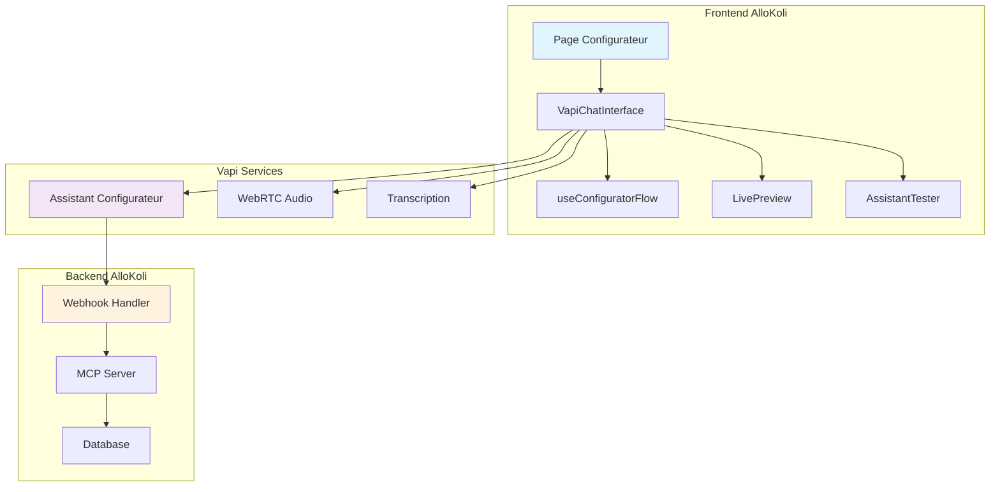

# 🧠 Roadmap Phase 2 - Intelligence & Interface Avancée

**Durée :** 3 semaines  
**Période :** Février 2025  
**Objectif :** Finaliser l'expérience utilisateur conversationnelle avec interface WebRTC et optimisations

---

## 🎯 Vue d'Ensemble Phase 2

### Contexte

✅ **Phase 1 TERMINÉE** : Assistant Configurateur Vapi Expert créé et opérationnel  
🎯 **Phase 2** : Créer l'interface frontend qui permet aux utilisateurs d'interagir avec l'assistant configurateur

### Principe Architectural

L'assistant configurateur Vapi existe déjà et fonctionne. La Phase 2 consiste à créer l'interface frontend qui :

- Se connecte à l'assistant configurateur via Vapi SDK
- Offre une expérience chat fluide vocal/textuel
- Affiche les résultats de la configuration en temps réel
- Permet le test immédiat de l'assistant créé

---

## 📅 Sprint Planning Phase 2

### Sprint 1 - Interface WebRTC & Chat (Semaine 1)

#### **Jour 1-2 : Interface Chat WebRTC**

- **Objectif :** Créer l'interface de chat vocal avec l'assistant configurateur
- **Livrables :**
  ```typescript
  // components/configurator/VapiChatInterface.tsx
  - Interface chat WebRTC native
  - Connexion à l'assistant configurateur Vapi
  - Gestion états conversation (connecting, active, idle)
  - Indicateurs visuels (microphone, volume, transcription)
  ```

#### **Jour 3-4 : États de Conversation**

- **Objectif :** Gérer les 4 étapes du flow configurateur
- **Livrables :**
  ```typescript
  // hooks/useConfiguratorFlow.ts
  - Détection automatique étape courante
  - Progress indicator visuel
  - Gestion des transitions entre étapes
  - Validation completion étapes
  ```

#### **Jour 5 : Tests & Integration**

- **Objectif :** Tester l'interface avec l'assistant réel
- **Livrables :**
  - Tests end-to-end conversation complète
  - Validation UX sur mobile/desktop
  - Performance WebRTC

### Sprint 2 - Visualisation Temps Réel (Semaine 2)

#### **Jour 6-7 : Live Preview Assistant**

- **Objectif :** Afficher la configuration en cours en temps réel
- **Livrables :**
  ```typescript
  // components/configurator/LivePreview.tsx
  - Preview assistant en cours de configuration
  - Affichage template sélectionné
  - Prévisualisation voix choisie
  - Résumé configuration finale
  ```

#### **Jour 8-9 : Assistant Preview Player**

- **Objectif :** Permettre le test de l'assistant créé
- **Livrables :**
  ```typescript
  // components/configurator/AssistantTester.tsx
  - Widget de test intégré
  - Interface de test conversationnel
  - Affichage métriques conversation
  - Boutons d'actions (modifier, déployer)
  ```

#### **Jour 10 : Voice Testing Interface**

- **Objectif :** Interface de test des voix pendant configuration
- **Livrables :**
  - Player audio pour échantillons voix
  - Interface sélection voix interactive
  - Phrases de test personnalisées

### Sprint 3 - Optimisations & Finitions (Semaine 3)

#### **Jour 11-12 : Optimisations Performance**

- **Objectif :** Optimiser latence et expérience utilisateur
- **Livrables :**
  - Optimisation connexions WebRTC
  - Cache intelligent responses
  - Preloading ressources voix
  - Gestion déconnexions/reconnexions

#### **Jour 13-14 : Analytics & Monitoring**

- **Objectif :** Tracking expérience utilisateur
- **Livrables :**
  - Métriques temps configuration
  - Tracking étapes abandonnées
  - Analytics qualité conversation
  - Dashboard admin simple

#### **Jour 15 : Tests Finaux & Deploy**

- **Objectif :** Validation complète et déploiement
- **Livrables :**
  - Tests end-to-end complets
  - Tests de charge interface
  - Déploiement production
  - Documentation utilisateur

---

## 🛠️ Spécifications Techniques Phase 2

### Architecture Frontend



### Composants Clés à Développer

#### 1. VapiChatInterface

```typescript
interface VapiChatInterfaceProps {
  configuratorAssistantId: string;
  onConfigurationComplete: (config: AssistantConfig) => void;
  onStepChange: (step: ConfiguratorStep) => void;
}

const VapiChatInterface = ({
  configuratorAssistantId,
  onConfigurationComplete,
  onStepChange,
}: VapiChatInterfaceProps) => {
  // Connexion WebRTC avec assistant configurateur
  // Gestion conversation vocal/textuel
  // Interface microphone/volume
  // Transcription temps réel
};
```

#### 2. useConfiguratorFlow Hook

```typescript
const useConfiguratorFlow = () => {
  const [currentStep, setCurrentStep] = useState<ConfiguratorStep>("discovery");
  const [collectedData, setCollectedData] = useState<ConfiguratorData>({});
  const [isComplete, setIsComplete] = useState(false);

  // Détection automatique étape via analyse messages
  // Extraction données configuration
  // Validation progression

  return {
    currentStep,
    collectedData,
    isComplete,
    progress: calculateProgress(currentStep),
  };
};
```

#### 3. LivePreview Component

```typescript
const LivePreview = ({ currentStep, collectedData }: LivePreviewProps) => {
  // Affichage template détecté
  // Preview voix sélectionnée
  // Résumé configuration temps réel
  // Indicateurs validation
};
```

### Integration avec Assistant Configurateur

#### Flow de Données

1. **Utilisateur** → Interface chat vocal
2. **Interface** → Assistant Configurateur Vapi
3. **Assistant** → Function calls vers webhooks
4. **Webhooks** → MCP Server pour actions
5. **Résultats** → Retour à l'assistant → Interface

#### Gestion des États

```typescript
type ConfiguratorStep =
  | "discovery" // Découverte entreprise
  | "voice" // Sélection voix
  | "knowledge" // Configuration KB
  | "creation" // Création assistant
  | "complete"; // Terminé

interface ConfiguratorData {
  businessInfo?: BusinessInfo;
  selectedTemplate?: Template;
  selectedVoice?: VoiceOption;
  knowledgeBase?: KnowledgeBaseConfig;
  finalAssistant?: CreatedAssistant;
}
```

---

## 📊 Métriques de Succès Phase 2

### KPIs Techniques

- **Latence WebRTC** : < 300ms
- **Taux de connexion** : > 95%
- **Stabilité conversation** : < 2% déconnexions
- **Performance mobile** : Fonctionne sur iOS/Android

### KPIs Utilisateur

- **Temps configuration** : < 8 minutes moyenne
- **Taux de completion** : > 80%
- **Satisfaction voix** : > 85% satisfaits
- **Facilité d'usage** : Score UX > 4/5

### KPIs Business

- **Conversion configuration** : > 70% finissent le process
- **Qualité assistants créés** : > 90% fonctionnels
- **Rétention utilisateurs** : > 60% reviennent

---

## 🚦 Définition de "Done" Phase 2

### Critères d'Acceptation

#### Interface Conversationnelle ✅

- [ ] Conversation vocale fluide avec assistant configurateur
- [ ] Interface chat responsive mobile/desktop
- [ ] Gestion déconnexions/reconnexions automatique
- [ ] Transcription temps réel visible

#### Flow Configurateur ✅

- [ ] Détection automatique des 4 étapes
- [ ] Progress indicator fonctionnel
- [ ] Extraction données configuration automatique
- [ ] Validation étapes avant passage suivante

#### Live Preview ✅

- [ ] Affichage template détecté en temps réel
- [ ] Preview voix avec échantillons audio
- [ ] Résumé configuration dynamique
- [ ] Bouton test assistant créé fonctionnel

#### Tests & Performance ✅

- [ ] Tests end-to-end conversation complète
- [ ] Performance WebRTC validée
- [ ] Tests mobile iOS/Android
- [ ] Métriques tracking implémentées

---

## 🎯 Risques & Mitigations Phase 2

### Risques Techniques

| Risque               | Impact | Probabilité | Mitigation                   |
| -------------------- | ------ | ----------- | ---------------------------- |
| Latence WebRTC       | Haut   | Moyen       | Tests charge + optimisations |
| Compatibilité mobile | Moyen  | Haut        | Tests dispositifs multiples  |
| Déconnexions réseau  | Moyen  | Moyen       | Reconnexion automatique      |

### Risques UX

| Risque             | Impact | Probabilité | Mitigation               |
| ------------------ | ------ | ----------- | ------------------------ |
| Confusion étapes   | Haut   | Moyen       | Progress indicator clair |
| Fatigue vocale     | Moyen  | Faible      | Mode textuel alternatif  |
| Attentes résultats | Haut   | Moyen       | Preview temps réel       |

---

## 🚀 Post Phase 2 - Préparation Phase 3

### Éléments à Préparer

- **Tests utilisateurs** : Recrutement early adopters
- **Métriques business** : Setup analytics avancées
- **Optimisations** : Plan performance scaling
- **Fonctionnalités avancées** : Roadmap features supplémentaires

### Validation Success

- ✅ Configuration complète en < 8 minutes
- ✅ Interface stable et intuitive
- ✅ Assistant créé fonctionnel à 100%
- ✅ Expérience mobile optimale

**🎉 Objectif Phase 2 :** Interface conversationnelle complète permettant à tout utilisateur de créer son assistant vocal en moins de 8 minutes via conversation naturelle avec l'assistant configurateur Vapi.
