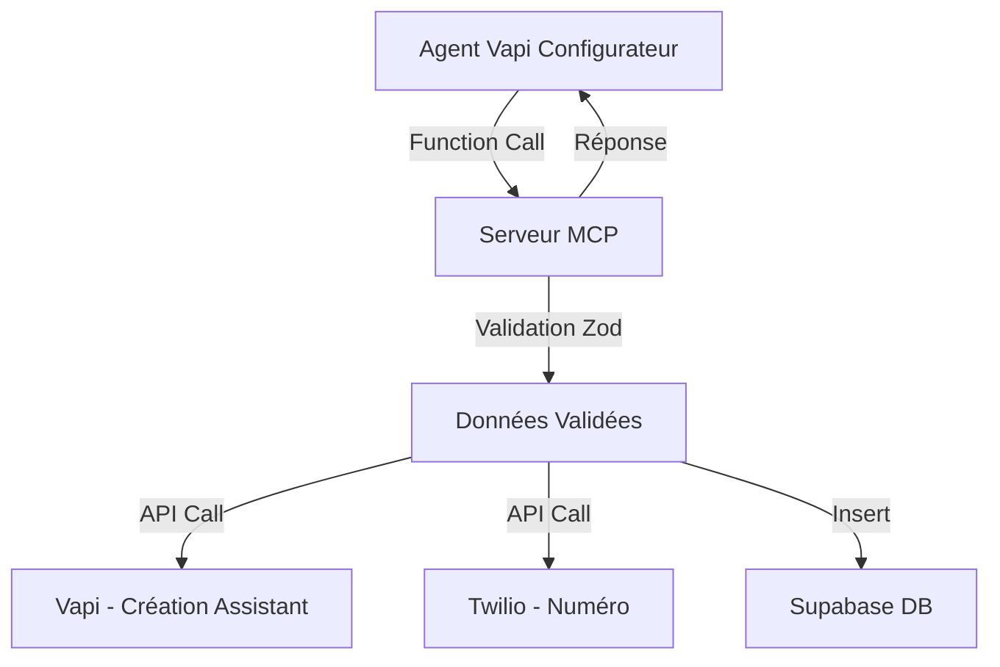

# 🤖 Serveur MCP AlloKoli

## 📋 Vue d'ensemble

Le serveur MCP (Model Context Protocol) AlloKoli est une Edge Function Supabase qui expose des outils pour créer et gérer des assistants vocaux avec numéros de téléphone. Il utilise la validation automatique Zod pour garantir l'intégrité des données et s'intègre avec Vapi et Twilio.

## 🛠️ Outils Disponibles

### 1. `createAssistantAndProvisionNumber`
Crée un assistant vocal complet avec numéro de téléphone provisionné automatiquement.

**Paramètres requis :**
- `assistantName` (string) : Nom de l'assistant vocal
- `businessType` (string) : Type d'activité de l'entreprise
- `assistantTone` (string) : Ton de communication de l'assistant
- `firstMessage` (string) : Message d'accueil de l'assistant
- `systemPromptCore` (string) : Prompt système principal

**Paramètres optionnels :**
- `canTakeReservations` (boolean) : L'assistant peut-il prendre des réservations
- `canTakeAppointments` (boolean) : L'assistant peut-il prendre des rendez-vous
- `canTransferCall` (boolean) : L'assistant peut-il transférer des appels
- `companyName` (string) : Nom de l'entreprise
- `address` (string) : Adresse de l'entreprise
- `phoneNumber` (string) : Numéro de téléphone de l'entreprise
- `email` (string) : Email de l'entreprise
- `openingHours` (string) : Horaires d'ouverture

**Exemple d'utilisation :**
```json
{
  "assistantName": "Assistant Restaurant Le Petit Bistro",
  "businessType": "restaurant",
  "assistantTone": "amical_chaleureux",
  "firstMessage": "Bonjour ! Bienvenue au Petit Bistro. Comment puis-je vous aider ?",
  "systemPromptCore": "Tu es l'assistant vocal du restaurant Le Petit Bistro...",
  "canTakeReservations": true,
  "companyName": "Le Petit Bistro",
  "address": "123 Rue de la Paix, 75001 Paris"
}
```

### 2. `provisionPhoneNumber`
Provisionne un nouveau numéro de téléphone via Twilio.

**Paramètres :**
- `country` (string, défaut: "FR") : Code pays
- `areaCode` (string, optionnel) : Indicatif régional
- `contains` (string, optionnel) : Pattern de recherche dans le numéro
- `assistantId` (string, optionnel) : ID de l'assistant à associer

### 3. `listAssistants`
Liste tous les assistants avec pagination et filtres.

**Paramètres :**
- `page` (number, défaut: 1) : Numéro de page
- `limit` (number, défaut: 20) : Nombre d'éléments par page
- `search` (string, optionnel) : Recherche par nom
- `sector` (string, optionnel) : Filtrer par secteur d'activité

### 4. `getAssistant`
Récupère les détails complets d'un assistant.

**Paramètres :**
- `assistantId` (string) : ID unique de l'assistant

### 5. `updateAssistant`
Met à jour les propriétés d'un assistant existant.

**Paramètres :**
- `assistantId` (string) : ID unique de l'assistant
- `updates` (object) : Propriétés à mettre à jour

## 🔧 Configuration

### Variables d'environnement requises

```bash
# Supabase
SUPABASE_URL=https://your-project.supabase.co
SUPABASE_SERVICE_ROLE_KEY=your-service-role-key

# Vapi
VAPI_API_KEY=your-vapi-api-key

# Twilio
TWILIO_ACCOUNT_SID=your-twilio-account-sid
TWILIO_AUTH_TOKEN=your-twilio-auth-token
```

## 🚀 Déploiement

### 1. Déployer la fonction
```bash
supabase functions deploy mcp-server
```

### 2. Configurer les variables d'environnement
```bash
supabase secrets set VAPI_API_KEY=your-key
supabase secrets set TWILIO_ACCOUNT_SID=your-sid
supabase secrets set TWILIO_AUTH_TOKEN=your-token
```

## 📡 Endpoints

### Route de découverte MCP
```
GET /mcp
```
Retourne la configuration MCP avec la liste des outils disponibles.

### Exécution d'outils
```
POST /mcp/tools/{toolName}
```
Exécute un outil spécifique avec les paramètres fournis.

**Headers requis :**
- `Authorization: Bearer {supabase-jwt-token}`
- `Content-Type: application/json`

## 🧪 Tests

### Exécuter les tests
```bash
cd supabase/functions/mcp-server
deno run --allow-env --allow-net test.ts
```

### Tests inclus
- ✅ Validation des schémas Zod
- ✅ Configuration MCP
- ✅ Génération de prompts système
- ✅ Détermination de secteur d'activité
- ✅ Variables d'environnement

## 🔒 Sécurité

### Authentification
- Toutes les routes d'outils nécessitent une authentification Supabase
- Validation JWT automatique
- Isolation des données par utilisateur (RLS)

### Validation des données
- Validation automatique avec schémas Zod
- Messages d'erreur détaillés en français
- Sanitisation des entrées utilisateur

### Gestion des erreurs
- Logging complet des erreurs
- Réponses d'erreur standardisées
- Pas d'exposition d'informations sensibles

## 📊 Monitoring

### Logs disponibles
- Erreurs de validation
- Échecs d'intégration (Vapi, Twilio)
- Performances des requêtes
- Authentification

### Métriques recommandées
- Temps de réponse par outil
- Taux de succès des créations d'assistants
- Utilisation des numéros Twilio
- Erreurs de validation fréquentes

## 🔄 Flux de données



## 🛡️ Validation Automatique

### Schémas Zod intégrés
- `CreateAssistantWithPhoneRequestSchema` : Validation complète des requêtes de création
- `ProvisionPhoneNumberRequestSchema` : Validation des paramètres Twilio
- `ListAssistantsRequestSchema` : Validation des filtres et pagination
- `GetAssistantRequestSchema` : Validation des IDs
- `UpdateAssistantRequestSchema` : Validation des mises à jour

### Avantages
- **Sécurité** : Aucune donnée invalide en base
- **Robustesse** : Détection précoce des erreurs
- **UX** : Messages d'erreur clairs en français
- **Maintenance** : Types TypeScript automatiques

## 📚 Exemples d'utilisation

### Création d'assistant restaurant
```javascript
const response = await fetch('/mcp/tools/createAssistantAndProvisionNumber', {
  method: 'POST',
  headers: {
    'Authorization': 'Bearer ' + token,
    'Content-Type': 'application/json'
  },
  body: JSON.stringify({
    assistantName: "Assistant Pizzeria Mario",
    businessType: "restaurant",
    assistantTone: "convivial",
    firstMessage: "Ciao ! Bienvenue chez Mario. Que puis-je faire pour vous ?",
    systemPromptCore: "Tu es l'assistant de la pizzeria Mario...",
    canTakeReservations: true,
    canTakeOrders: true
  })
});
```

### Liste des assistants avec filtre
```javascript
const response = await fetch('/mcp/tools/listAssistants', {
  method: 'POST',
  headers: {
    'Authorization': 'Bearer ' + token,
    'Content-Type': 'application/json'
  },
  body: JSON.stringify({
    page: 1,
    limit: 10,
    sector: "restaurant"
  })
});
```

## 🔮 Évolutions futures

### Fonctionnalités prévues
- [ ] Outil `deleteAssistant`
- [ ] Outil `configureWebhooks`
- [ ] Outil `getCallAnalytics`
- [ ] Support multi-langues
- [ ] Intégration avec d'autres providers vocaux

### Améliorations techniques
- [ ] Cache Redis pour les requêtes fréquentes
- [ ] Retry logic pour les APIs externes
- [ ] Webhooks bidirectionnels Vapi ↔ AlloKoli
- [ ] Tests d'intégration automatisés

## 📞 Support

Pour toute question ou problème :
1. Vérifier les logs Supabase
2. Exécuter les tests de validation
3. Consulter la documentation Vapi et Twilio
4. Contacter l'équipe de développement AlloKoli 